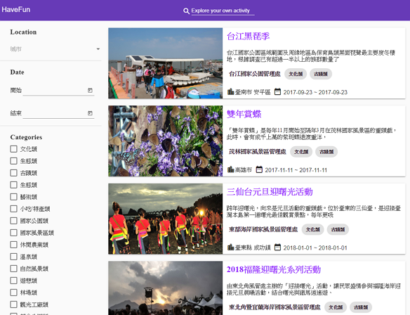

# AngualrTravelApp

 Based on [設計稿](https://hexschool.github.io/THE_F2E_Design/week2-filter/), the Taiwan travel web application are built Angular 6 and Angular Material 6.2. The goal is to show how to filter the json data array. It also features:
- The Keyword Search
- The City Search
- The Open Hour

  

## Live Demo

[GitHub Page](https://carolcheng.github.io/angualr-travel-app/) | 
[Source Code](https://github.com/CarolCheng/angualr-travel-app)

## Open API

[觀光資訊資料庫](https://data.gov.tw/dataset/7778)

## Build

Run `ng build` to build the project. The build artifacts will be stored in the `dist/` directory. Use the `--prod` flag for a production build.

## Running unit tests

Run `ng test` to execute the unit tests via [Karma](https://karma-runner.github.io).

## Running end-to-end tests

Run `ng e2e` to execute the end-to-end tests via [Protractor](http://www.protractortest.org/).

## Further help

To get more help on the Angular CLI use `ng help` or go check out the [Angular CLI README](https://github.com/angular/angular-cli/blob/master/README.md).
